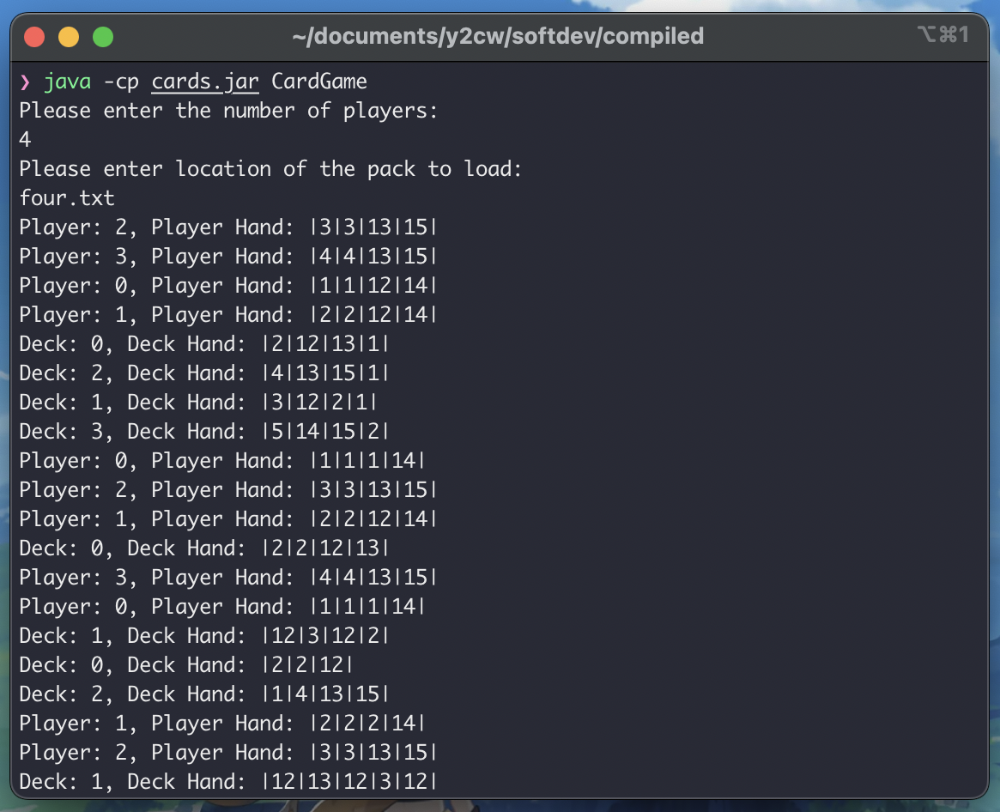

# Software Development Coursework
This is a card game simulation for ECM2414.
The specifications of the coursework can be accessed [**[here]**](https://vle.exeter.ac.uk/pluginfile.php/2928632/mod_resource/content/4/ECM2414-CA.pdf).

---

### Development Log:
Report and development log can be accessed [**[here]**](https://docs.google.com/document/d/1efVfDojbHq9gj7MsKIC0tWfkxsV8oPPakLHVPrK8uq4/edit?usp=sharing).

---

### How to use:
Very simple, all you need to do is to run the JAR with this following command while in the "compiled" directory:
`java -cp cards.jar CardGame`.

If it does not, then please contact me at: cwol201@exeter.ac.uk

---

### File-paths Clarifications:
- The player output logs will always be written to the "logs" folder where the program is ran.
- When the program asks for a pack, make sure your "pack.txt" is stored in the packs folder.
- To change either of these, modify the Utilities class. In doing so, also make sure to change the JUnit tests.

---

### Extras:
To recompile into cards.jar, as long as all the paths remain the same, you can just run the `easyCompile.sh` file in the compiled directory.
Keep in mind this is only for Linux and Mac(Unix) users.

---

### License:
Completely Open-Sourced - [MIT License](./LICENSE)

